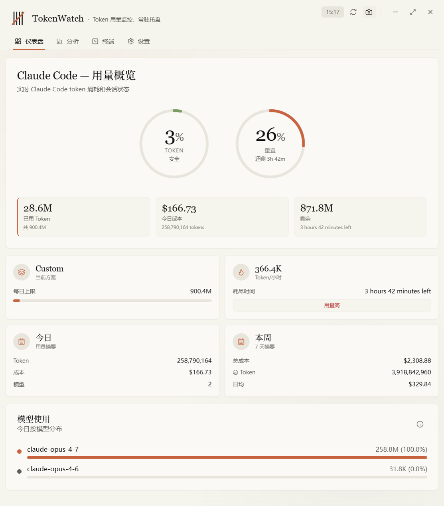
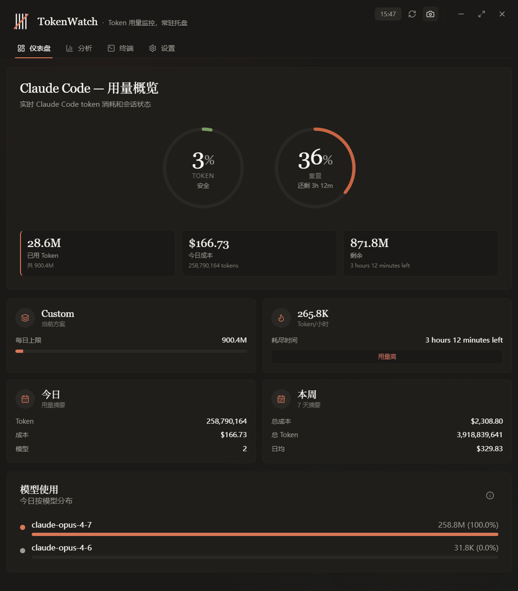
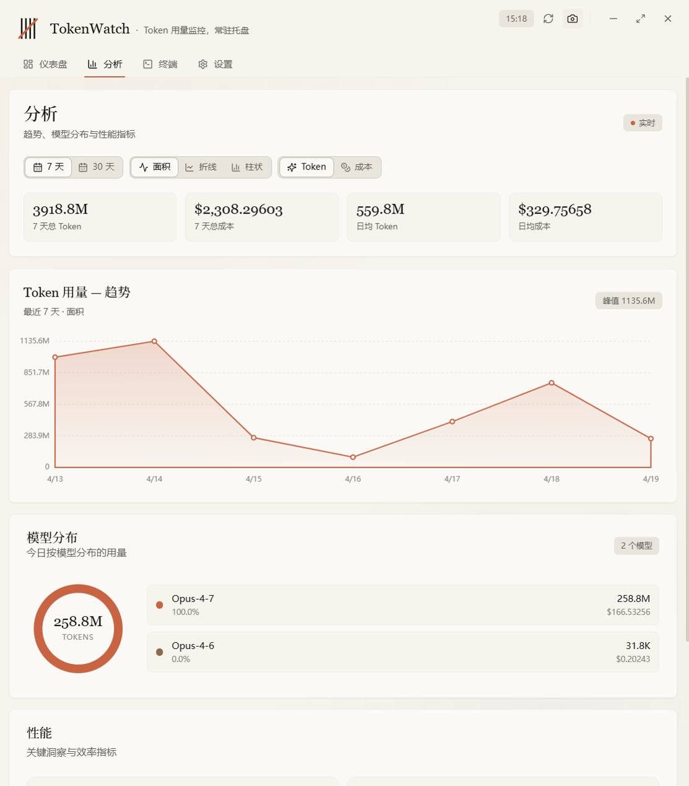
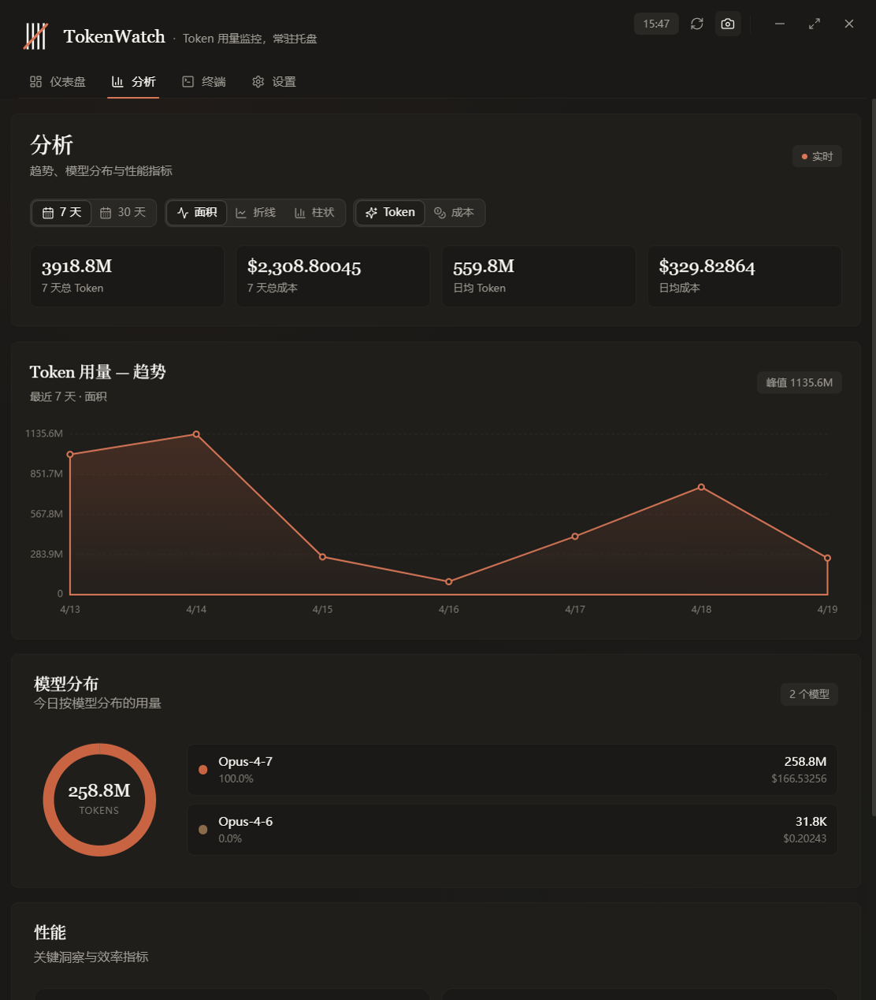
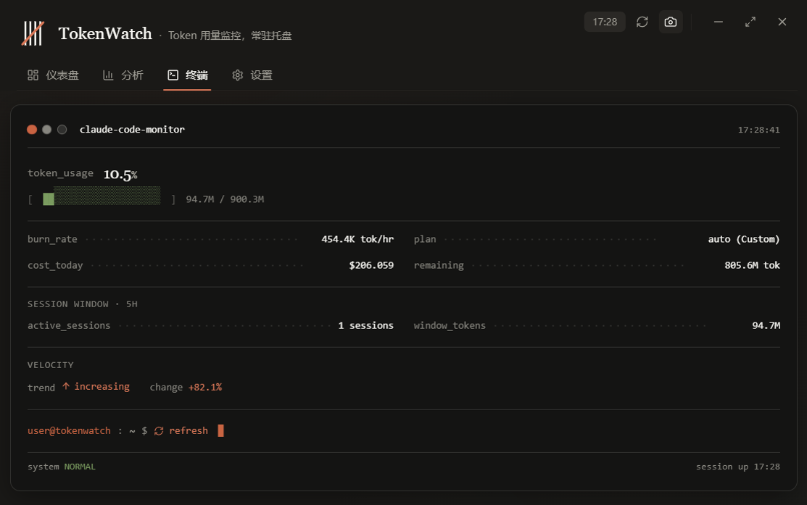

# TokenWatch

[](https://polyformproject.org/licenses/noncommercial/1.0.0/)
[](#installation--%E5%AE%89%E8%A3%85)
[](#installation--%E5%AE%89%E8%A3%85)
[](#installation--%E5%AE%89%E8%A3%85)

**English** · [简体中文](#%E7%AE%80%E4%BD%93%E4%B8%AD%E6%96%87)

A warm, editorial tray app that keeps a quiet eye on your Claude Code token usage. Lives in the system tray on Windows, menu bar on macOS, or indicator area on Linux; shows real-time consumption, cost, and burn rate, and stays out of the way the rest of the time.

一个温暖、克制的托盘应用，默默守望你的 Claude Code token 使用情况。常驻 Windows 系统托盘 / macOS 菜单栏 / Linux 指示器区域；实时显示消耗、费用和燃烧速率，其他时候安静不打扰。

## Screenshots / 截图

TokenWatch ships with both **light** and **dark** themes. / 支持**浅色**与**深色**两套主题。

### Dashboard / 仪表盘

<table>
<tr>
<th width="50%">Light / 浅色</th>
<th width="50%">Dark / 深色</th>
</tr>
<tr>
<td></td>
<td></td>
</tr>
</table>

### Analytics / 分析

<table>
<tr>
<th width="50%">Light / 浅色</th>
<th width="50%">Dark / 深色</th>
</tr>
<tr>
<td></td>
<td></td>
</tr>
</table>

### Terminal / 终端



---

## Features

- **Live tray display** — hovering the tray icon shows the current usage percentage and cost; click to open the full view
- **Parchment UI** — warm Claude-inspired design system (serif headings, terracotta accents, ring shadows) instead of the usual cool-grey dashboard look
- **Standalone window mode** — optional normal resizable window with a taskbar entry, in addition to the default tray-anchored popup
- **Instant cold start** — persists the last snapshot to disk so subsequent launches render the full UI immediately, then refresh in the background
- **Worker-thread parsing** — ccusage JSONL parsing runs in a `worker_threads` worker so the tray and UI stay responsive while large histories load
- **Smart plan detection** — auto-detects Pro / Max5 / Max20 / Custom from actual usage, or pick one manually
- **Analytics** — 7-day and 30-day trends as area / line / bar, model distribution donut, per-hour burn rate, plan utilization, depletion prediction
- **Terminal view** — a calm monospace readout for when you just want the numbers
- **Smart notifications** — alerts at 70% and 90% thresholds with cooldown
- **Single-instance lock** — relaunching surfaces the existing window instead of spawning a duplicate tray icon
- **Launch on startup** *(optional)* — starts minimized to the tray when you sign in
- **i18n** — English and 简体中文, auto-detected from the system

## Installation / 安装

Download the latest release from [GitHub Releases](https://github.com/sooua/TokenWatch/releases/latest).

### Windows

- **Installer**: `TokenWatch-Setup-<version>-x64.exe` (NSIS, custom install directory, desktop & start-menu shortcuts)
- **Portable**: `TokenWatch-Portable-<version>-x64.exe` (no installation required)

Windows 10 / 11 (x64). Binaries are unsigned — SmartScreen will prompt on first launch; click **More info → Run anyway**.

### macOS

- **Apple Silicon**: `TokenWatch-<version>-arm64.dmg`
- **Intel**: `TokenWatch-<version>.dmg`

macOS 10.15+. Binaries are unsigned — the first launch needs `System Settings → Privacy & Security → Open Anyway`, or from the terminal:

```bash
xattr -cr /Applications/TokenWatch.app
```

### Linux

- **AppImage**: `TokenWatch-<version>.AppImage`

```bash
chmod +x TokenWatch-*.AppImage
./TokenWatch-*.AppImage
```

AppImages are self-contained and portable — no system-wide install, no package manager required.

### Build from source

```bash
git clone <this-repo>
cd tokenwatch
npm install   # also applies patches/ccusage+*.patch via postinstall
npm run build
npm start
```

Packaging:

```bash
npm run dist:mac     # macOS DMG (x64 + arm64 universal)
npm run dist:win     # Windows NSIS installer + portable exe
npm run dist:linux   # Linux AppImage
npm run dist         # Current platform (auto)
```

> **Note**: `npm install` runs `patch-package` on `postinstall` to apply a small local patch to ccusage (`patches/ccusage+18.0.8.patch`). The patch:
>
> 1. **Skips the pre-read file sort** — `loadSessionBlockData` opens and streams every JSONL file just to find its earliest timestamp, then opens each file again to read entries. `identifySessionBlocks` already sorts entries by timestamp internally, so the pre-sort is redundant. Cuts cold-start I/O in half.
> 2. **Parallelizes file processing** — the upstream serial `for (const file of sortedFiles) await processJSONLFileByLine(file, ...)` is replaced with a bounded `Promise.all` (cap: 32 concurrent files) to keep libuv's I/O thread pool busy.
> 3. **Persists LiteLLM pricing to disk** — the upstream fetcher re-downloads pricing from GitHub on every run. We cache the response at `~/.tokenwatch/pricing-cache.json` with a 24h TTL and skip the network round-trip when the cache is fresh. Cost calculation accuracy is unchanged.
>
> Typical impact on a 1,700-file history: cold start ~49s → ~12–30s depending on disk cache state. Subsequent runs also avoid the 1–5s LiteLLM fetch.

#### Windows packaging prerequisites

`electron-builder` creates symbolic links while extracting the `winCodeSign` helper on Windows. If the build fails with `Cannot create symbolic link : 客户端没有所需的特权` (or similar), enable one of the following:

1. **Windows Developer Mode** *(recommended)*: Settings → Privacy & security → For developers → turn on **Developer Mode**, then rerun `npm run dist:win`.
2. Run the terminal as Administrator and rerun the build.

If a prior failed build left a bad cache, delete it and retry:

```powershell
Remove-Item -Recurse -Force "$env:LOCALAPPDATA\electron-builder\Cache\winCodeSign"
```

We don't ship signed Windows binaries; unless you set your own certificate, builds skip code signing automatically (`CSC_IDENTITY_AUTO_DISCOVERY=false` is safe to set if you see signing prompts).

## Usage

1. **Launch** — TokenWatch appears in your menu bar (macOS) or notification area / system tray (Windows)
2. **Left-click the tray icon** — toggle the main window
3. **Right-click the tray icon** — context menu: current usage %, cost, Open, Refresh, Quit
4. **Drag the window** — the header is the drag handle (frameless window with custom Claude-styled controls)

The app reads your Claude Code usage history from `~/.claude/projects/**/*.jsonl` and refreshes every 30 seconds.

### Platform differences

| Behavior | macOS | Windows |
|---|---|---|
| Tray label (% / $) | Rendered as text directly in the menu bar via `Tray.setTitle` | Shown in the tooltip on hover and in the right-click context menu header (Windows tray icons cannot display text) |
| Tray icon | Empty (text-only) | PNG / ICO icon (`assets/tray.ico`) |
| Window chrome | Custom title bar (no native) | Custom title bar with minimize / maximize / close buttons |
| Window anchor | Top-right, near the menu bar | Near the tray icon, clamped to the active display |
| Notifications | Native Notification Center | Toast center (requires `AppUserModelId`, set automatically) |

## Requirements

- macOS 10.15+ **or** Windows 10/11 (x64)
- Node.js 18+ (for building from source)
- Claude Code CLI installed and configured (there must be JSONL logs under `~/.claude/projects`)

## Tech Stack

- Electron 36 + React 19 + TypeScript 5
- Tailwind CSS 3 with a custom Claude-inspired warm palette
- Radix UI primitives
- i18next + react-i18next
- ccusage for usage data (with local performance patches via patch-package)

## Data stored locally

TokenWatch keeps small files under `~/.tokenwatch/`:

- `settings.json` — user preferences (language, plan, display mode, etc.)
- `stats-cache.json` — last-known usage snapshot, used to render the UI instantly on cold start
- `pricing-cache.json` — LiteLLM model pricing table, 24h TTL

Nothing is sent anywhere else — the only network call is ccusage's pricing fetch from GitHub (cached).

## License

[PolyForm Noncommercial License 1.0.0](https://polyformproject.org/licenses/noncommercial/1.0.0/) — free for personal, research, educational, and other noncommercial use. Commercial use requires a separate license. See [LICENSE](LICENSE).

Portions derived from [CCSeva](https://github.com/Iamshankhadeep/ccseva) remain under their original MIT license; that notice is retained inside [LICENSE](LICENSE).

## Credits

TokenWatch is based on [CCSeva](https://github.com/Iamshankhadeep/ccseva) by **Iamshankhadeep** (MIT). The Windows port, warm-parchment UI redesign, worker-thread parsing, ccusage performance patches, frameless custom title bar, and i18n support were added on top of that foundation.

Built with [Electron](https://electronjs.org), [React](https://reactjs.org), [Tailwind CSS](https://tailwindcss.com), [Radix UI](https://www.radix-ui.com), [lucide-react](https://lucide.dev), and [ccusage](https://github.com/ryoppippi/ccusage).

---

## 简体中文

[English](#tokenwatch) · **简体中文**

TokenWatch 是一款跨平台（Windows + macOS + Linux）托盘/菜单栏 Electron 应用，用温暖克制的界面实时关注你的 Claude Code token 使用情况。它常驻系统托盘，显示当前用量百分比与费用，点击展开完整视图；其余时候安静地待在角落里。

### 功能特性

- **实时托盘显示** — 悬停托盘图标显示当前用量百分比与费用，点击打开完整窗口
- **羊皮纸 UI** — 温暖的 Claude 风格设计系统（衬线标题、赤陶色点缀、柔和投影），告别冷灰色仪表盘的套路
- **独立窗口模式** — 可选的普通可缩放窗口模式，带任务栏入口，默认为托盘锚定弹窗
- **瞬时冷启动** — 上次数据快照持久化到磁盘，二次启动立刻渲染完整 UI，随后在后台刷新
- **Worker 线程解析** — ccusage 的 JSONL 解析在 `worker_threads` 中进行，即使历史数据很大，托盘和 UI 也不会卡顿
- **智能套餐识别** — 根据实际用量自动识别 Pro / Max5 / Max20 / Custom，也可手动选择
- **分析图表** — 7 天 / 30 天用量趋势（面积图 / 折线 / 柱状），模型分布环形图，每小时燃烧速率，套餐利用率，耗尽时间预测
- **终端视图** — 纯等宽字体的安静读数视图，当你只想看数字时使用
- **智能通知** — 70% 和 90% 阈值提醒，带冷却时间避免打扰
- **单实例锁** — 再次启动只会唤起已有窗口，不会生成重复托盘图标
- **开机自启**（可选）— 登录后最小化到托盘启动
- **多语言** — 支持 English 和简体中文，自动跟随系统

### 安装

在 [GitHub Releases](https://github.com/sooua/TokenWatch/releases/latest) 下载最新版本。

#### Windows

- **安装版**：`TokenWatch-Setup-<version>-x64.exe`（NSIS 安装器，支持自定义安装目录、桌面与开始菜单快捷方式）
- **便携版**：`TokenWatch-Portable-<version>-x64.exe`（免安装直接运行）

支持 Windows 10 / 11 (x64)。二进制文件未签名，首次启动 SmartScreen 会提示，点击**更多信息 → 仍要运行**即可。

#### macOS

- **Apple Silicon**：`TokenWatch-<version>-arm64.dmg`
- **Intel**：`TokenWatch-<version>.dmg`

支持 macOS 10.15+。二进制文件未签名，首次启动需在**系统设置 → 隐私与安全性**中点击**仍要打开**，或在终端执行：

```bash
xattr -cr /Applications/TokenWatch.app
```

#### Linux

- **AppImage**：`TokenWatch-<version>.AppImage`

```bash
chmod +x TokenWatch-*.AppImage
./TokenWatch-*.AppImage
```

AppImage 是自包含的可移植包，无需系统级安装，也不依赖包管理器。

#### 从源码构建

```bash
git clone <本仓库>
cd tokenwatch
npm install   # postinstall 会自动应用 patches/ccusage+*.patch
npm run build
npm start
```

打包：

```bash
npm run dist:mac     # macOS DMG (x64 + arm64 universal)
npm run dist:win     # Windows NSIS 安装器 + 便携版
npm run dist:linux   # Linux AppImage
npm run dist         # 当前平台（自动识别）
```

> **说明**：`npm install` 会通过 `postinstall` 钩子调用 `patch-package`，对 ccusage 应用一个本地补丁（`patches/ccusage+18.0.8.patch`）：
>
> 1. **跳过预读文件排序** — `loadSessionBlockData` 原本会把每个 JSONL 文件打开一次、流式读出首个时间戳用来排序，然后再次打开读取全部条目。但 `identifySessionBlocks` 内部已经按时间戳排序，这次预排序是多余的。冷启动 I/O 开销直接砍半。
> 2. **并行处理文件** — 上游 `for (const file of sortedFiles) await processJSONLFileByLine(file, ...)` 的串行写法被改为有界的 `Promise.all`（上限 32 个并发文件），让 libuv 的 I/O 线程池忙起来。
> 3. **LiteLLM 价格表磁盘缓存** — 上游每次运行都会从 GitHub 重新下载价格表。我们将其缓存到 `~/.tokenwatch/pricing-cache.json`，24 小时 TTL，缓存命中时跳过网络请求。费用计算精度不变。
>
> 在 1,700 个历史文件的规模下，冷启动时间从 ~49 秒降到 ~12–30 秒（取决于磁盘缓存状态），且后续运行也免除 1–5 秒的 LiteLLM 请求。

##### Windows 打包前置条件

`electron-builder` 在 Windows 上解压 `winCodeSign` 时会尝试创建符号链接。如果构建失败并提示 `Cannot create symbolic link : 客户端没有所需的特权` 一类的错误，启用以下任一方式即可：

1. **Windows 开发者模式**（推荐）：设置 → 隐私和安全性 → 开发者选项 → 开启**开发者模式**，然后重新运行 `npm run dist:win`。
2. 以管理员身份运行终端，然后重新构建。

若之前的失败构建在缓存中留下了损坏文件，删掉后重试：

```powershell
Remove-Item -Recurse -Force "$env:LOCALAPPDATA\electron-builder\Cache\winCodeSign"
```

我们不提供签名的 Windows 二进制文件；除非你自己设置了证书，否则构建会自动跳过代码签名（若出现签名提示，可安全地设置 `CSC_IDENTITY_AUTO_DISCOVERY=false`）。

### 使用

1. **启动** — TokenWatch 出现在菜单栏（macOS）或通知区域 / 系统托盘（Windows）
2. **左键点击托盘图标** — 切换主窗口显示
3. **右键点击托盘图标** — 弹出上下文菜单：当前用量百分比与费用、打开、刷新、退出
4. **拖动窗口** — 头部区域是拖拽把手（无原生边框窗口，带 Claude 风格的自定义控件）

应用从 `~/.claude/projects/**/*.jsonl` 读取你的 Claude Code 使用历史，每 30 秒刷新一次。

#### 平台差异

| 行为 | macOS | Windows |
|---|---|---|
| 托盘标签（% / $） | 通过 `Tray.setTitle` 直接以文字渲染在菜单栏 | 显示在悬停 tooltip 以及右键菜单头部（Windows 托盘图标无法直接显示文字） |
| 托盘图标 | 无（纯文字） | PNG / ICO 图标（`assets/tray.ico`） |
| 窗口外框 | 自定义标题栏（无原生） | 自定义标题栏，含最小化 / 最大化 / 关闭按钮 |
| 窗口锚定 | 右上角，靠近菜单栏 | 托盘图标附近，自动限制在当前显示器范围内 |
| 通知 | 原生通知中心 | Toast 通知（需 `AppUserModelId`，已自动设置） |

### 环境要求

- macOS 10.15+ **或** Windows 10/11 (x64)
- Node.js 18+（仅源码构建时需要）
- 已安装并配置好的 Claude Code CLI（`~/.claude/projects` 下必须有 JSONL 日志）

### 技术栈

- Electron 36 + React 19 + TypeScript 5
- Tailwind CSS 3，搭配自定义的 Claude 暖色调色板
- Radix UI 原语
- i18next + react-i18next
- ccusage 提供用量数据（通过 patch-package 应用本地性能补丁）

### 本地数据

TokenWatch 在 `~/.tokenwatch/` 下保存少量文件：

- `settings.json` — 用户偏好（语言、套餐、显示模式等）
- `stats-cache.json` — 上次用量快照，用于冷启动即时渲染
- `pricing-cache.json` — LiteLLM 模型价格表，24 小时 TTL

数据不会发送到任何其他地方 — 唯一的网络请求是 ccusage 从 GitHub 拉取价格表（已缓存）。

### 许可证

采用 [PolyForm Noncommercial License 1.0.0](https://polyformproject.org/licenses/noncommercial/1.0.0/)，个人使用、研究、教学及其他非商业用途完全免费；商业用途需另行获得授权。详见 [LICENSE](LICENSE)。

源自 [CCSeva](https://github.com/Iamshankhadeep/ccseva) 的部分仍沿用其原始 MIT 许可，该声明已保留在 [LICENSE](LICENSE) 文件中。

### 致谢

TokenWatch 基于 **Iamshankhadeep** 的 [CCSeva](https://github.com/Iamshankhadeep/ccseva)（MIT）开发。在此基础上加入了 Windows 移植、羊皮纸暖色 UI 重设计、Worker 线程解析、ccusage 性能补丁、无边框自定义标题栏以及国际化支持。

使用 [Electron](https://electronjs.org)、[React](https://reactjs.org)、[Tailwind CSS](https://tailwindcss.com)、[Radix UI](https://www.radix-ui.com)、[lucide-react](https://lucide.dev) 和 [ccusage](https://github.com/ryoppippi/ccusage) 构建。
